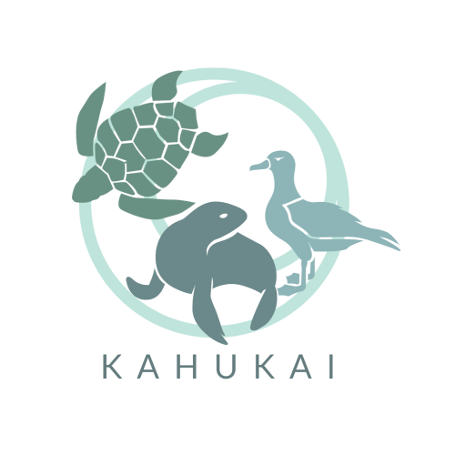

## Bloombugs HMAR Application for HACC 2021

## Table of contents

* [Overview](#overview)
* [User Guide](#user-guide)
* [Development History](#development-history)
* [Team](#team)

## Overview

For HACC 2021, we decided to choose the challenge proposed by NIC Hawaii, the Hawaii Marine Animal Response (HMAR) Sighting & Reporting App. Currently HMAR handles all animal sighting reports by phone. HMAR and NIC mentioned that they would like to have the ability to handle reports via an application as well - to decrease the amount of phone traffic and confusion as well as make it easier to record each sighting.

Our solution for HMAR HACC’s problem is a web browser application that will be accessible on both mobile and computer. We will have different landing pages for the public users who are reporting animal sightings on the go and for the admin users accounts who are the HMAR staff that are managing the sighting reports database. There will be a login page for the admin users to access these additional capabilities. The public users will be shown a landing page with a link to the animal in distress form, animal sighting form, and a more information page. The admin users will have a landing page with a link to submitting a report, or viewing a log of all past submitted reports. When a report is submitted there will be a notification of a new sighting to the admin user. We are using Meteor etc. to create the application and Mongo will be used to store the animal sightings. Using Meteor will allow the application to be supported on a web browser and mobile devices. The application will be hosted on a Digital Ocean droplet.

For our Bloombugs project we are building off our HMAR HACC solution where we will have each user including the public users register and log in, to have an individual state for each account. It will be individualized through having the public users being able to view their history of past submitted reports. We also will add a function of editing one’s profile to make it more personalized for each user. We will be using the same tech stack as the HMAR HACC and also additional technologies such as ESLint, IDPM, Semantic UI/React.

## User Guide

This section provides a walkthrough of the HMAR application user interface and its capabilities.

### Landing Page

The landing page is presented to users when they visit the top-level URL to the site.

### Sign in and sign up

Click on the "Login" button in the upper right corner of the navbar, then select "Sign in" to go to the following page and login.

### Profile edit page

Allows user to store the information about the user.

### Public user landing page

After logging in as a public user, you are taken to public user landing page which will display three buttons: Animal in distress, Animal sighting, and More information. The enter a new report page for the admin user will redircted to this page.

### Animal in Distress

This will show HMAR's phone number.

### Animal signting pages

The will four different pages with the same layout. It will be the seal, bird, turtle, and other pages.

### Click for more information

This page will show the user how to spot an animal in distress.

### Admin user landing page

After logging in as an admin user, you are taken to admin user landing page which will display two buttons: Report a sighting and Look at Records. Clicking the report a sighting will redirect to the public user landing page. Clicking the look at records will redirect to the Look at records page.

### Look at records page

This is the record database for all the submitted forms.

## Development History

### Milestone 1: Finish HACC application

The goal of Milestone 1 is to finish the HACC application.

### Milestone 2: Add users / admin functionality, “Beyond the Basics”

The goal of Milestone 2 is to add public user and admin user functionality. "Beyond the basics" includes: database filter functionality; standardizing date, time, and locations, reporting seal identifying markings, identification of seabird species, updating "click for more information".

### Milestone 3: Polishing and optimizing for all devices

The goal of Milestone 3 is optimize the web application for all devices.

## Team

Kahukai, our sighting app for HMAR is designed, implemented, and maintained by [Jacob Hardy](https://jakehardy95.github.io/), [Kelly Hwang](https://hwangkyh.github.io/), [Kiana Walters](https://kianaleilani.github.io/), [Kylie Higashionna](https://kyliehigashionna.github.io/), [Taryn Takebayashi](https://microtaryn.github.io/).

